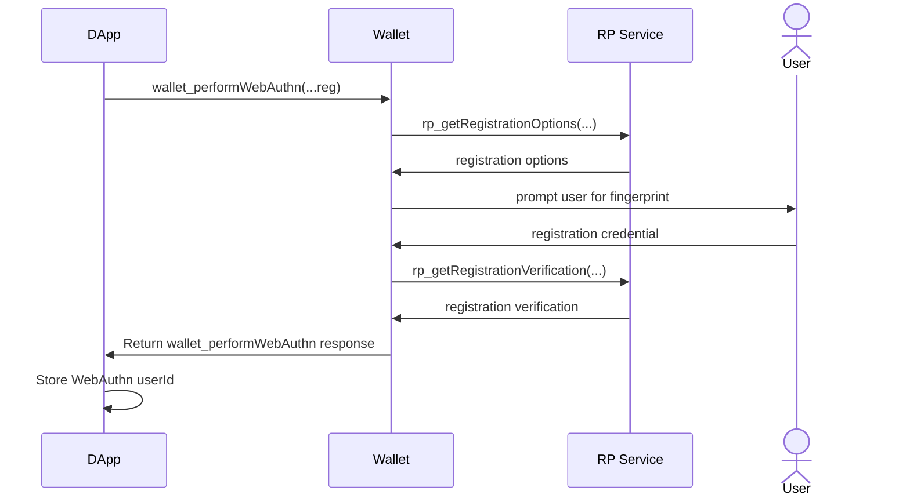
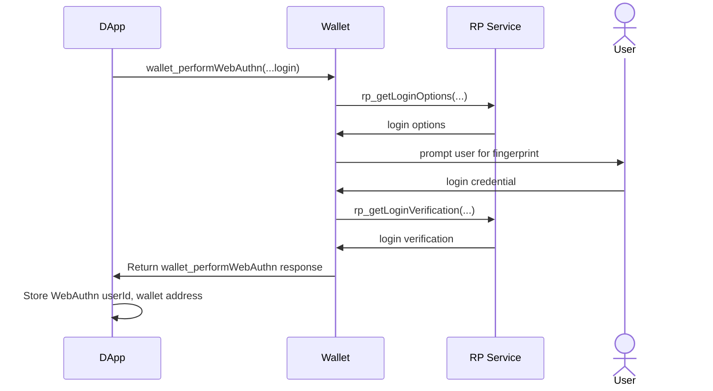
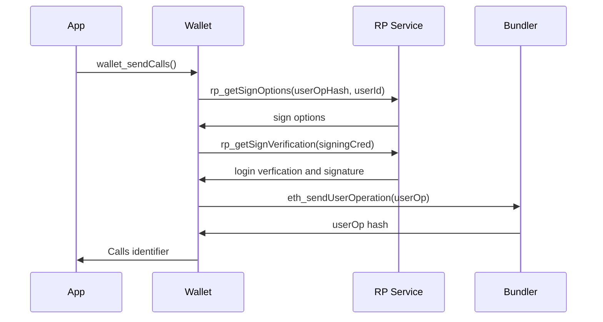

<!--
  READ EIP-1 (https://eips.ethereum.org/EIPS/eip-1) BEFORE USING THIS TEMPLATE!

  This is the suggested template for new EIPs. After you have filled in the requisite fields, please delete these comments.

  Note that an EIP number will be assigned by an editor. When opening a pull request to submit your EIP, please use an abbreviated title in the filename, `eip-draft_title_abbrev.md`.

  The title should be 44 characters or less. It should not repeat the EIP number in title, irrespective of the category.

  TODO: Remove this comment before submitting
-->

## Abstract

<!--
  The Abstract is a multi-sentence (short paragraph) technical summary. This should be a very terse and human-readable version of the specification section. Someone should be able to read only the abstract to get the gist of what this specification does.

  TODO: Remove this comment before submitting
-->

## Motivation

<!--
  This section is optional.

  The motivation section should include a description of any nontrivial problems the EIP solves. It should not describe how the EIP solves those problems, unless it is not immediately obvious. It should not describe why the EIP should be made into a standard, unless it is not immediately obvious.

  With a few exceptions, external links are not allowed. If you feel that a particular resource would demonstrate a compelling case for your EIP, then save it as a printer-friendly PDF, put it in the assets folder, and link to that copy.

  TODO: Remove this comment before submitting
-->

## Specification

<!--
  The Specification section should describe the syntax and semantics of any new feature. The specification should be detailed enough to allow competing, interoperable implementations for any of the current Ethereum platforms (besu, erigon, ethereumjs, go-ethereum, nethermind, or others).

  It is recommended to follow RFC 2119 and RFC 8170. Do not remove the key word definitions if RFC 2119 and RFC 8170 are followed.

  TODO: Remove this comment before submitting
-->

The key words "MUST", "MUST NOT", "REQUIRED", "SHALL", "SHALL NOT", "SHOULD", "SHOULD NOT", "RECOMMENDED", "NOT RECOMMENDED", "MAY", and "OPTIONAL" in this document are to be interpreted as described in RFC 2119 and RFC 8174.

### `wallet_performWebAuthn`

We introduce a `wallet_performWebAuthn` method for the Dapp to request the Wallet to perform Web Authentication operations.

#### Request Specification

```typescript
type PerformWebAuthnRequestParams = {
    
};
```

#### Response Specification

**Example of the registration flow**


**Example of the login flow**


### Relying Party Web Service Interface

#### `rp_getRegistrationOptions`
#### `rp_getRegistrationVerification`
#### `rp_getLoginOptions`
#### `rp_getLoginVerification`
#### `rp_getSignOptions`
#### `rp_getSignVerification`

### `webAuthnService` Capability


The `paymasterService` capability is implemented by both apps and wallets.

#### App Implementation

Apps need to give wallets a paymaster service URL they can make the above RPC calls to. They can do this using the `paymasterService` capability as part of an [EIP-5792](./eip-5792.md) `wallet_sendCalls` call.

##### `wallet_sendCalls` Paymaster Capability Specification

```typescript
type webAuthnCapabilityParams = {
  url: string;
  context: Record<string, any>;
}
```

###### `wallet_sendCalls` Example Parameters

```json
[
  {
    "version": "1.0",
    "chainId": "0x01",
    "from": "0xd46e8dd67c5d32be8058bb8eb970870f07244567",
    "calls": [
      {
        "to": "0xd46e8dd67c5d32be8058bb8eb970870f07244567",
        "value": "0x9184e72a",
        "data": "0xd46e8dd67c5d32be8d46e8dd67c5d32be8058bb8eb970870f072445675058bb8eb970870f072445675"
      },
      {
        "to": "0xd46e8dd67c5d32be8058bb8eb970870f07244567",
        "value": "0x182183",
        "data": "0xfbadbaf01"
      }
    ],
    "capabilities": {
      "webAuthnCapability": {
        "url": "https://...",
        "context": {
          "entityId": "962b252c-a726-4a37-8d86-333ce0a07299"
        }
      }
    }
  }
]
```

The wallet will then make the above webAuthn RPC calls to the URL specified in the `webAuthnCapability` capability field.

#### Wallet Implementation

To conform to this specification, smart wallets that wish to leverage WebAuthn Relying Party service:
1. MUST indicate to apps that they can communicate with WebAuthn Relying Party via their response to an [EIP-5792](./eip-5792.md) `wallet_getCapabilities` call.
2. SHOULD make calls to and use the values returned by the WebAuthn Relying Party service specified in the capabilities field of an [EIP-5792](./eip-5792.md) `wallet_sendCalls` call.

##### `wallet_getCapabilities` Response Specification

```typescript
type WebAuthnServiceCapability = {
  supported: boolean;
}
```

###### `wallet_getCapabilities` Example Response

```json
{
  "0x2105": {
    "webAuthnService": {
      "supported": true
    },
  },
  "0x14A34": {
    "webAuthnService": {
      "supported": true
    }
  }
}
```

Below is a diagram illustrating the full `wallet_sendCalls` flow, including how a wallet might implement the interaction.


## Rationale

<!--
  The rationale fleshes out the specification by describing what motivated the design and why particular design decisions were made. It should describe alternate designs that were considered and related work, e.g. how the feature is supported in other languages.

  The current placeholder is acceptable for a draft.

  TODO: Remove this comment before submitting
-->

TBD

## Backwards Compatibility

<!--

  This section is optional.

  All EIPs that introduce backwards incompatibilities must include a section describing these incompatibilities and their severity. The EIP must explain how the author proposes to deal with these incompatibilities. EIP submissions without a sufficient backwards compatibility treatise may be rejected outright.

  The current placeholder is acceptable for a draft.

  TODO: Remove this comment before submitting
-->

No backward compatibility issues found.

## Test Cases

<!--
  This section is optional for non-Core EIPs.

  The Test Cases section should include expected input/output pairs, but may include a succinct set of executable tests. It should not include project build files. No new requirements may be be introduced here (meaning an implementation following only the Specification section should pass all tests here.)
  If the test suite is too large to reasonably be included inline, then consider adding it as one or more files in `../assets/eip-####/`. External links will not be allowed

  TODO: Remove this comment before submitting
-->

## Reference Implementation

<!--
  This section is optional.

  The Reference Implementation section should include a minimal implementation that assists in understanding or implementing this specification. It should not include project build files. The reference implementation is not a replacement for the Specification section, and the proposal should still be understandable without it.
  If the reference implementation is too large to reasonably be included inline, then consider adding it as one or more files in `../assets/eip-####/`. External links will not be allowed.

  TODO: Remove this comment before submitting
-->

## Security Considerations

<!--
  All EIPs must contain a section that discusses the security implications/considerations relevant to the proposed change. Include information that might be important for security discussions, surfaces risks and can be used throughout the life cycle of the proposal. For example, include security-relevant design decisions, concerns, important discussions, implementation-specific guidance and pitfalls, an outline of threats and risks and how they are being addressed. EIP submissions missing the "Security Considerations" section will be rejected. An EIP cannot proceed to status "Final" without a Security Considerations discussion deemed sufficient by the reviewers.

  The current placeholder is acceptable for a draft.

  TODO: Remove this comment before submitting
-->

Needs discussion.

## Copyright

Copyright and related rights waived via [CC0](../LICENSE.md).
